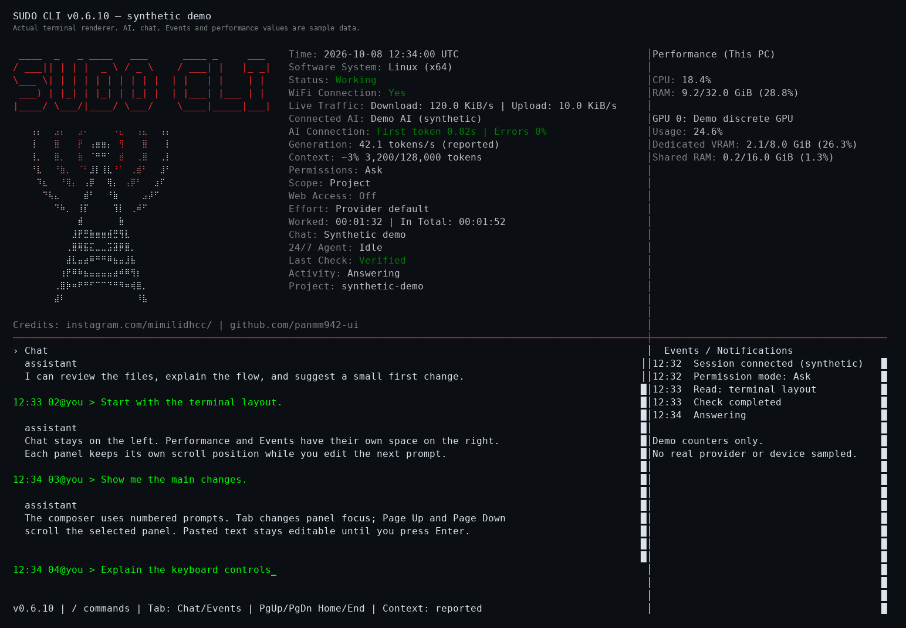
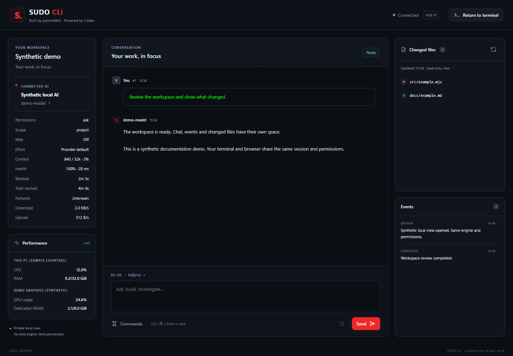

# SUDO CLI

[](https://github.com/panmm942-ui/sudo_cli/releases)
[](docs/platforms.md)
[](LICENSE)
[](THIRD_PARTY.md)

**Your coding session. Terminal or GUI.**

A separate interface for the open-source Codex engine, with the original red SUDO CLI dashboard and animated antenna. Start offline, connect a local or cloud AI, and keep the same chat, permissions and work when you open the graphical view.

## ✨ One session, two views

| Terminal | GUI | Work you can inspect |
| --- | --- | --- |
| Numbered prompts, a dedicated composer and scrollable chat | Open with `/gui`; return to the terminal without restarting the AI | Added, modified and deleted project files |
| Separate Events and live Performance panels | Chat, Events, command picker, approvals and changed files | Bounded read-only previews, checkpoints and conflict-aware undo |





The screenshots use synthetic project data. See [interface controls and limits](docs/interface.md).

## 🚀 Install and launch

Download a package from [Releases](https://github.com/panmm942-ui/sudo_cli/releases), extract it, and keep the `codexcli` folder in its final location. Setup registers a command pointing to that folder; rerun setup if you move it.

**Windows:** the portable x64 package includes Node.js and Codex. Open PowerShell in the extracted folder and run:

```powershell
.\setup.cmd
```

Open a **new Administrator terminal**, navigate to your project, then run:

```powershell
sudocli
```

**Linux and macOS:** install Node.js 22+ and run setup as your regular user:

```sh
sh ./setup
sudo "$HOME/.local/bin/sudocli"
```

Setup verifies the pinned engine and registers `sudocli` for the current user. Windows updates the user PATH; Unix uses `~/.local/bin` and a managed shell startup block. The full Unix command path also works when sudo resets PATH.

`sudocli --help`, `sudocli --version` and `sudocli doctor` work without elevation or a model request. Direct launchers are `.\sudocli.cmd` and `sudo sh ./sudocli`. Source packages require Node.js 22+; setup downloads the compatible pinned runtime. [Platform setup](docs/platforms.md) covers shell configuration and command-only registration.

## 🧠 Connect your AI

The default interactive launch stays offline until you choose an AI.

- `/local` connects to an already-running Ollama, LM Studio or compatible local server. Local authentication is optional.
- `/connect` configures a cloud or local endpoint; `/switch` selects a saved AI while carrying the chat.
- `/local file "PATH"` inspects model files and offers supported installed runners. Model loading depends on architecture, runner support and available hardware.
- `/chat` opens saved project chats; `/new` starts a new one.

Keys stay in memory unless you explicitly select OS-protected credential storage. Preferences are saved per endpoint/model/protocol. See [local AI and agents](docs/local-ai-and-agents.md), [model files](docs/local-model-files.md) and [credential controls](docs/user-guide.md).

## 🛠️ Inspect the work

`/changes` shows current project changes. Git projects include staged, unstaged and untracked files. Other folders compare against the inventory captured when this session opened. Both views show incomplete coverage and unavailable or binary previews explicitly; Git is optional.

`/changes CHECKPOINT_ID` reviews a saved task checkpoint. `/verify COMMAND` runs your acceptance check; `/undo CHECKPOINT_ID` restores recorded edits while preserving later conflicting changes. Observed project changes can also include your own edits.

`/agents` runs specialists in isolated source copies; applying a proposal is explicit. `/247` manages durable background jobs, with optional schedules and OS startup. These features require configured models and a running computer. [User guide](docs/user-guide.md) · [Agents](docs/local-ai-and-agents.md) · [Background work](docs/always-on.md)

## 🔐 Access stays explicit

Interactive sessions require administrator/root admission, while agent access defaults to **Ask · project scope · Web Off**. Admission does not grant unrestricted model access.

`/permissions` controls approvals, scopes, exposed tools and additional write folders. `/budget` sets optional task/day limits; provider billing remains authoritative. Web Off restricts native tool networking while the host can still call the selected model API. Native sandbox behavior depends on the platform.

Signed packages verify an Ed25519 file manifest before startup and refuse altered or missing signed files. Native shutdown verifies owned helpers; unverified cleanup reports an error and prevents replacement sessions. [Privileges](docs/privileges.md) · [Signed releases](docs/release-integrity.md) · [Session cleanup](docs/native-session-lifecycle.md)

## 🎛️ Make it yours

`/` opens the command picker. `/help` searches commands, `/prompt` accepts multiline text, and `/stop` or Ctrl+C interrupts active work. `/textcolor` and `/bgcolor` change chat colors; the dashboard retains its palette. `/notify on|off` controls non-speaking task tones.

Voice needs configured ASR/TTS services and audio tools. Browser/desktop control needs the supported scoped browser adapter or an external MCP service. Training and rented GPU hooks depend on compatible providers; the CLI does not provision those services. [Voice](docs/live-voice.md) · [Optional services](docs/services.md) · [Operations](docs/operations.md)

## 📖 Documentation and source

[Interface](docs/interface.md) · [Quick guide](docs/user-guide.md) · [Platforms](docs/platforms.md) · [Release integrity](docs/release-integrity.md)

The unchanged native engine is **OpenAI Codex 0.160.1**, tag `rust-v0.160.1`, commit `d27764b82f7118f674371e6d6e76271d9d606edb`. Its complete Apache-2.0 source archive is included at [upstream/codex-rust-v0.160.1-source.zip](upstream/codex-rust-v0.160.1-source.zip). This frontend and its tests use MIT; bundled **Node.js 24.19.0** retains its MIT and dependency notices. No npm runtime dependencies are required.

Keep the included licenses, public credits and upstream notices when distributing packages. [LICENSE](LICENSE) · [THIRD_PARTY.md](THIRD_PARTY.md) · [Licenses](licenses) · [Official upstream source](https://github.com/openai/codex/tree/rust-v0.160.1)

Historical verification documents remain evidence for their named releases. Fixture-based model tests establish transport and tool behavior; they do not guarantee a real model's decisions, every provider or physical audio/driver behavior.

## ❤️ Credits

[Instagram: @mimilidhcc](https://www.instagram.com/mimilidhcc/) · [GitHub: panmm942-ui](https://github.com/panmm942-ui)
